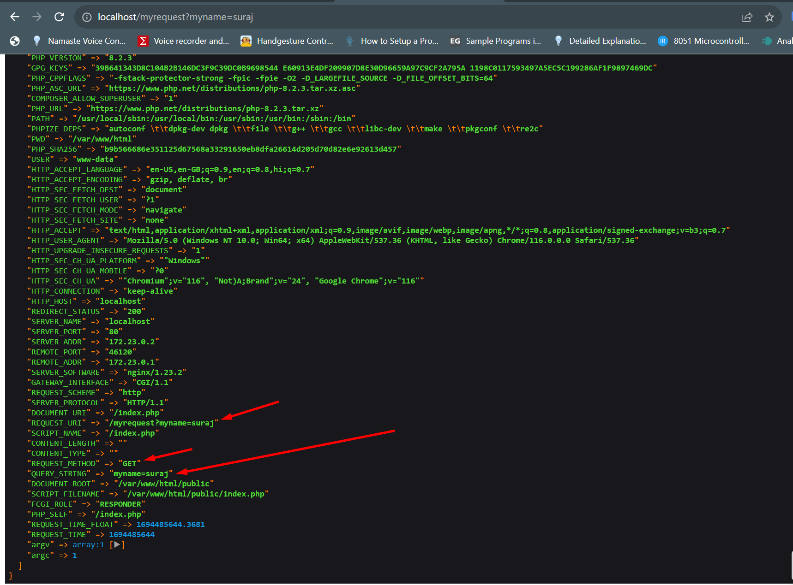
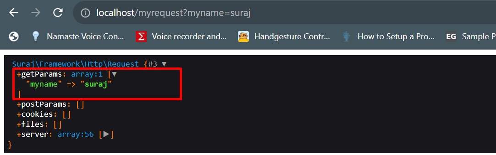

# php-web-app

# why required index.php
1. Centralized control -> work as main controller file
2. System maintainability
3. Configurability

# command to run website locally
## php -S localhost:8000 public/index.php

# Autoloading

### Create composer file named "composer.json"
    Add required configuration in composer file
    for autoloading autoload configuration added in composer.json
### run command to dump your autoload files

docker compose exec app composer dump-autoload
#### add new composer dependency
    command : docker compose exec app composer require symfony/var-dumper

# Request Classes

### install the symfony http compoentn module 
    composer require symfony/http-foundation
### create a framework class to handle requests
    framewwork/http/request.php
    instantiate class in index.php
    dump request
    
### images

### Handle request and response with single class entiry
    kernel handle which accept request and return response.